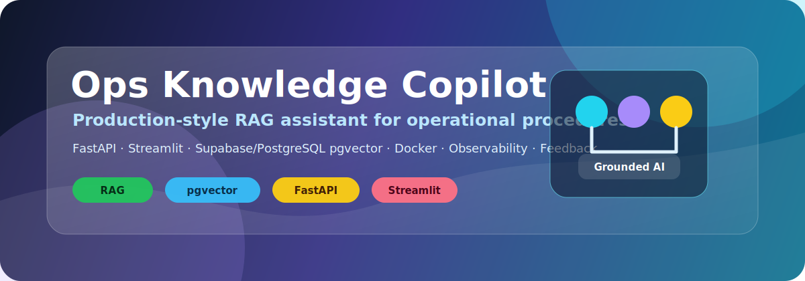
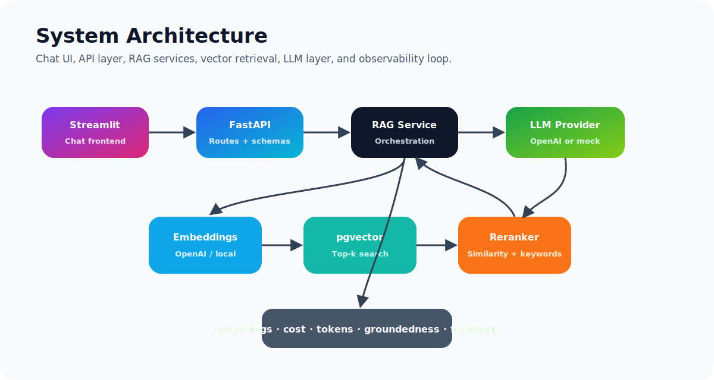
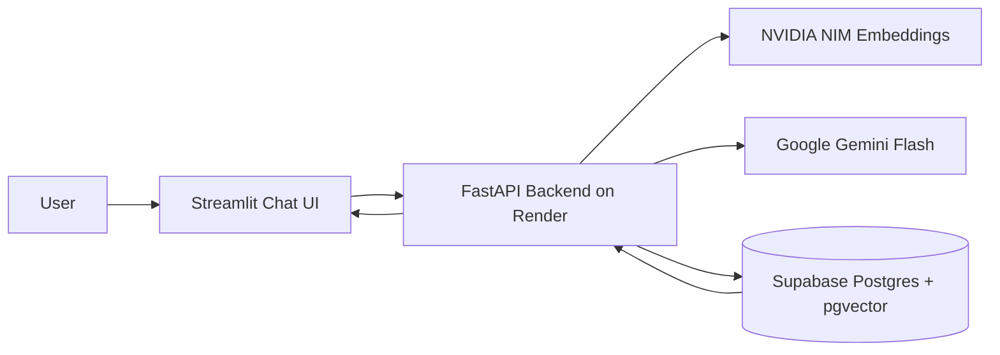
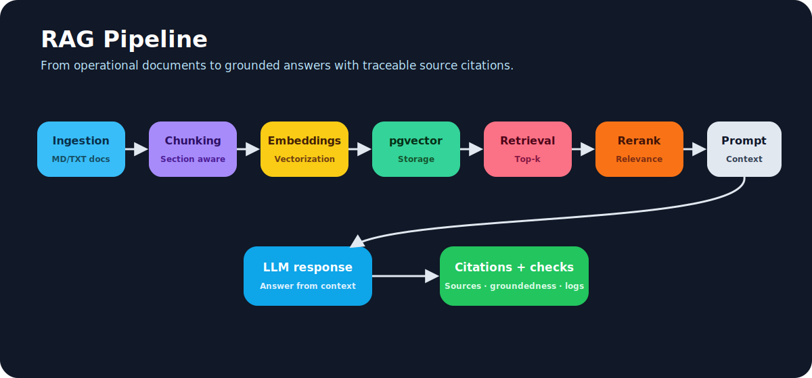
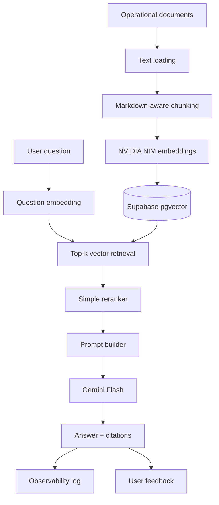
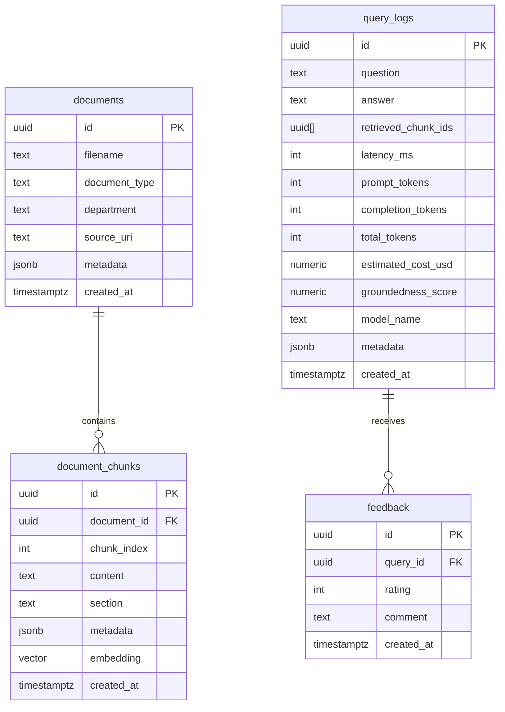
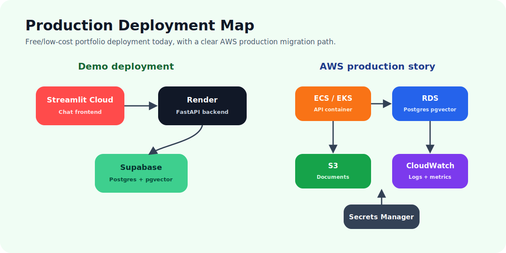
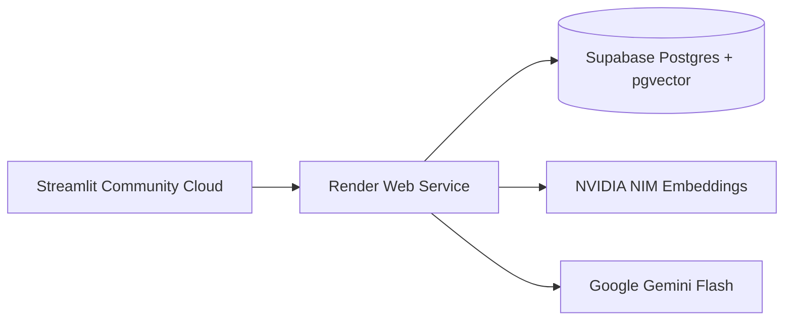

<p align="center">
  
</p>

# 🧠 Ops Knowledge Copilot

**Production-style RAG application for operational knowledge.**

This repo demonstrates a modern AI engineering stack:

<p align="center">
  
  
  
  
  
  
  
</p>

---

## 🚀 What this project proves

`Ops Knowledge Copilot` is a portfolio-grade project designed to demonstrate practical AI engineering skills beyond notebooks and prototypes.

It includes:

- ✅ **FastAPI backend** with modular routes, Pydantic models, dependency injection, async endpoints and error handling
- ✅ **Streamlit chat frontend** for a simple deployed user experience
- ✅ **RAG pipeline** with ingestion, chunking, embeddings, retrieval, reranking, prompt building and source citations
- ✅ **NVIDIA NIM embeddings** using `nvidia/nv-embedcode-7b-v1`
- ✅ **Google Gemini Flash chat model** for answer generation
- ✅ **Supabase Postgres + pgvector** for document chunks, metadata, vectors, logs and feedback
- ✅ **Metadata filtering** by department and document type
- ✅ **LLM observability**: latency, tokens, model name, estimated cost and groundedness score
- ✅ **Human feedback loop** through a `/feedback` endpoint and Streamlit UI
- ✅ **Production deployment path**: Streamlit Community Cloud + Render + Supabase
- ✅ **AWS mapping**: ECS/EKS, RDS PostgreSQL, S3, Secrets Manager and CloudWatch

The documents in `sample_docs/` are synthetic operational procedures. No confidential or proprietary information is used.

---

## 🏗️ System architecture

<p align="center">
  
</p>



### Main runtime flow

1. User asks a question in the Streamlit chat UI.
2. Streamlit calls the deployed FastAPI `/query` endpoint.
3. FastAPI embeds the question using NVIDIA NIM.
4. Supabase pgvector performs semantic retrieval over stored document chunks.
5. Retrieved chunks are reranked.
6. A grounded prompt is assembled with retrieved context.
7. Gemini Flash generates the final answer.
8. The API returns answer, source citations and observability metadata.
9. The user can submit feedback on the answer.

---

## 🔍 RAG pipeline

<p align="center">
  
</p>



### Retrieval design

The project stores each chunk with:

- `content`
- `section`
- `filename`
- `document_type`
- `department`
- `metadata`
- `embedding VECTOR(4096)`

`nv-embedcode-7b-v1` produces high-dimensional embeddings, so this project uses exact vector similarity search in PostgreSQL:

```sql
ORDER BY embedding <=> :query_embedding
LIMIT :top_k
```

For this small portfolio dataset, exact search is simpler, reliable and transparent. For large production datasets, the repo documentation explains options such as dimensionality reduction, lower-dimensional embeddings, external vector databases or high-dimensional indexing strategies.

---

## 💬 Chat UI

The Streamlit app provides:

- Chat-style interaction
- Top-k retrieval slider
- Department metadata filter
- Health check button
- Sample document ingestion button
- Upload for `.md` and `.txt` files
- Source citation expander
- Observability expander
- Feedback form for the last answer

Run locally:

```bash
streamlit run streamlit_app.py
```

---

## 🧩 API endpoints

| Method | Endpoint | Purpose |
|---|---|---|
| `GET` | `/health` | Checks API and database connectivity |
| `POST` | `/documents/ingest-sample` | Ingests synthetic operational documents |
| `POST` | `/documents/upload` | Uploads a `.md` or `.txt` document |
| `POST` | `/query` | Runs the RAG query flow |
| `POST` | `/feedback` | Stores human feedback |
| `GET` | `/metrics/{query_id}` | Retrieves observability metrics for a query |

---

## 🗃️ Database model



---

## ⚙️ Configuration

Copy the example environment file:

```bash
cp .env.example .env
```

For the target production configuration:

```env
EMBEDDING_PROVIDER=nvidia
CHAT_PROVIDER=gemini

NVIDIA_API_KEY=your_nvidia_nim_key
NVIDIA_EMBEDDING_MODEL=nvidia/nv-embedcode-7b-v1
EMBEDDING_DIM=4096

GEMINI_API_KEY=your_gemini_api_key
GEMINI_CHAT_MODEL=gemini-2.0-flash

DATABASE_URL=your_supabase_postgres_pooler_url
DATABASE_SSL=true
```

For local offline development without external model APIs:

```env
EMBEDDING_PROVIDER=local
CHAT_PROVIDER=local
EMBEDDING_DIM=4096
DATABASE_SSL=false
```

---

## 🧪 Local backend run without Docker

```bash
python -m venv .venv
source .venv/bin/activate  # Windows: .venv\Scripts\activate
pip install -r requirements.txt
uvicorn app.main:app --reload
```

Open:

```text
http://localhost:8000/docs
```

---

## 🐳 Local run with Docker Compose

Docker Compose runs:

- FastAPI backend
- PostgreSQL with pgvector

```bash
docker compose up --build
```

Then open:

```text
http://localhost:8000/docs
```

---

## ☁️ Production deployment map

<p align="center">
  
</p>

Recommended free/low-cost deployment:



### 1. Supabase

1. Create a Supabase project.
2. Open SQL Editor.
3. Run `scripts/supabase_schema.sql`.
4. Copy the Supabase Postgres connection string.
5. Use the pooler connection string for Render.
6. Set `DATABASE_SSL=true`.

### 2. Render backend

Use this start command:

```bash
uvicorn app.main:app --host 0.0.0.0 --port $PORT
```

Set environment variables:

```env
DATABASE_URL=your_supabase_pooler_url
DATABASE_SSL=true
EMBEDDING_PROVIDER=nvidia
NVIDIA_API_KEY=your_nvidia_key
NVIDIA_EMBEDDING_MODEL=nvidia/nv-embedcode-7b-v1
EMBEDDING_DIM=4096
CHAT_PROVIDER=gemini
GEMINI_API_KEY=your_gemini_key
GEMINI_CHAT_MODEL=gemini-2.0-flash
CORS_ORIGINS=*
```

### 3. Streamlit Community Cloud

Deploy `streamlit_app.py` and set this secret:

```toml
API_BASE_URL = "https://your-render-service.onrender.com"
```

---

## 📊 Observability and feedback loop

<p align="center">
  
</p>

Every query logs:

- user question
- answer
- retrieved chunks
- latency in milliseconds
- prompt tokens
- completion tokens
- total tokens
- model name
- estimated cost
- groundedness score

The feedback endpoint stores user rating and comments. This can later become an evaluation dataset.

---

## 🧠 Why this is production-style

This is not just a notebook demo. The project separates responsibilities into maintainable services:

```text
app/services/
  chunking_service.py
  embedding_service.py
  vector_store.py
  reranker.py
  prompt_builder.py
  llm_service.py
  rag_service.py
  groundedness_service.py
  observability_service.py
```

The API routes stay thin. The RAG orchestration lives in `RagService`. Configuration is environment-driven. The frontend talks to the backend through HTTP, similar to a real deployed application.

---

## 🧪 Example questions

Try these after ingesting sample documents:

```text
What should a technician do if abnormal vibration occurs after pump startup?
```

```text
When must a safety incident be escalated to the operations manager?
```

```text
What is the fallback process when the monitoring platform is unavailable?
```

Unsupported question to test hallucination control:

```text
What is the airline passenger compensation policy for volcanic ash disruption?
```

Expected behavior: the assistant should refuse or state that the provided documents do not contain enough information.

---

## 🧑‍💼 Interview explanation

> I built Ops Knowledge Copilot as a production-style RAG application. It has a Streamlit chat frontend, a FastAPI backend, Supabase Postgres with pgvector, NVIDIA NIM embeddings, Gemini Flash for answer generation, source citations, observability and a feedback loop.  
>  
> The sample documents are synthetic operational procedures, but the architecture is domain-independent. The same system could be used for airline operations, maintenance manuals, safety procedures, internal IT support, engineering standards or disruption workflows.

---

## 🗺️ AWS production mapping

Although the demo uses Streamlit + Render + Supabase, the architecture maps naturally to AWS:

| Demo component | AWS production equivalent |
|---|---|
| Streamlit frontend | CloudFront + React/Next.js or internal web app |
| Render FastAPI service | ECS Fargate or EKS |
| Supabase Postgres | Amazon RDS PostgreSQL with pgvector |
| Uploaded documents | S3 |
| Environment variables | AWS Secrets Manager / Parameter Store |
| Application logs | CloudWatch Logs |
| Metrics and alarms | CloudWatch Metrics / Alarms |

---

## 📌 Roadmap

- [ ] Add authentication
- [ ] Add per-user document access control
- [ ] Add PDF ingestion
- [ ] Add hybrid keyword + vector retrieval
- [ ] Add stronger reranker
- [ ] Add LangGraph multi-agent mode
- [ ] Add Airflow scheduled ingestion pipeline
- [ ] Add GitHub Actions deployment workflow
- [ ] Add Langfuse/OpenTelemetry-style LLM observability
- [ ] Add automated RAG evaluation dataset

---

## ⚠️ Notes

This repo is for portfolio and demonstration purposes. The synthetic documents are fictional and must not be interpreted as real operational procedures.
