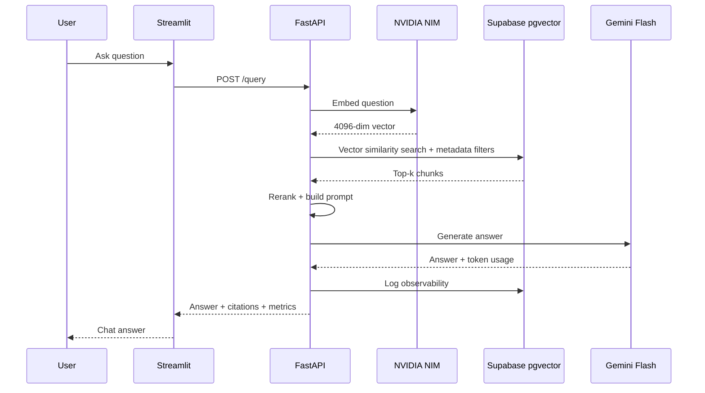

# Architecture

Ops Knowledge Copilot is a production-style RAG application with a decoupled frontend and backend.

## Components

- **Streamlit frontend**: chat UI, document upload, source display, feedback form.
- **FastAPI backend**: REST API for ingestion, query, feedback, health and metrics.
- **Supabase Postgres + pgvector**: stores documents, chunks, embeddings, query logs and feedback.
- **NVIDIA NIM**: generates embeddings using `nvidia/nv-embedcode-7b-v1`.
- **Google Gemini Flash**: generates final grounded answers.
- **Render**: hosts the FastAPI backend.

## Request flow

## Production design principles

- API routes remain thin.
- RAG orchestration is handled by `RagService`.
- Providers are configurable through environment variables.
- No secrets are committed to the repo.
- Source citations are returned with every answer.
- Observability and feedback are part of the core workflow.
